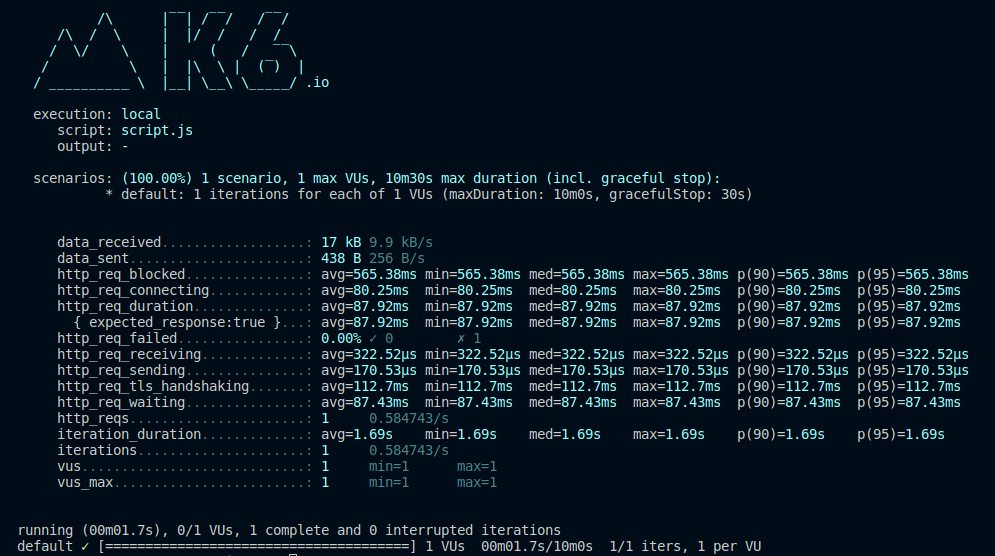
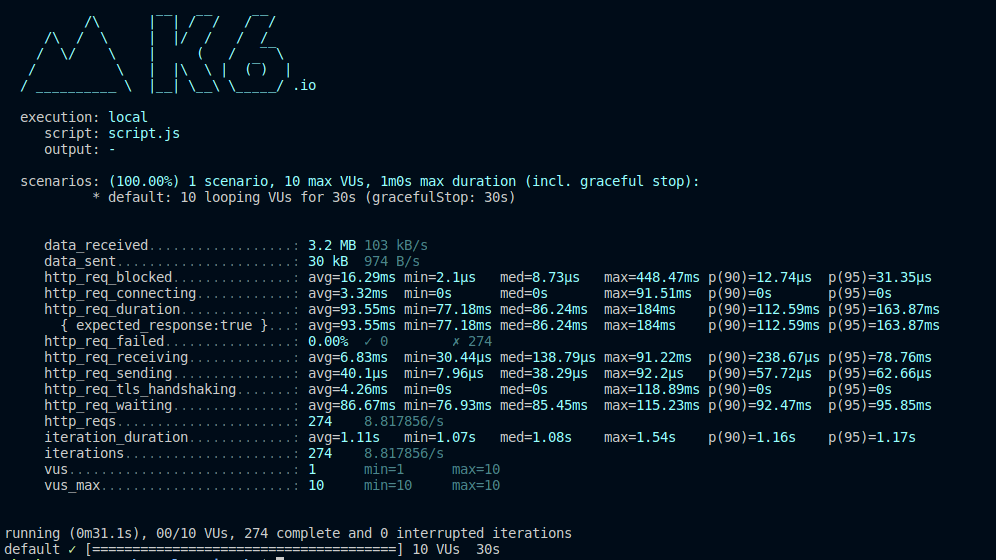

# Learning k6

## Description

Welcome! This repository is a collection of k6-related things to help me understand what it is and how it works.

Installation docs on k6 found [here](https://github.com/abenipa3/learning-k6#sources-used-for-learning). 

### How to run local tests with k6
Run k6 with the following command on the CLI:
```
k6 run script.js
```

### How to run load tests with more than one virtual user and a longer duration
Just as the title mentioned, here is the following command to run a 30 second, 10-VU load test:
```
k6 run --vus 10 --duration 30s script.js
```

## Sources used for learning:

- Documentation: https://k6.io/docs/get-started/resources/
- k6 Source Code: https://github.com/grafana/k6

